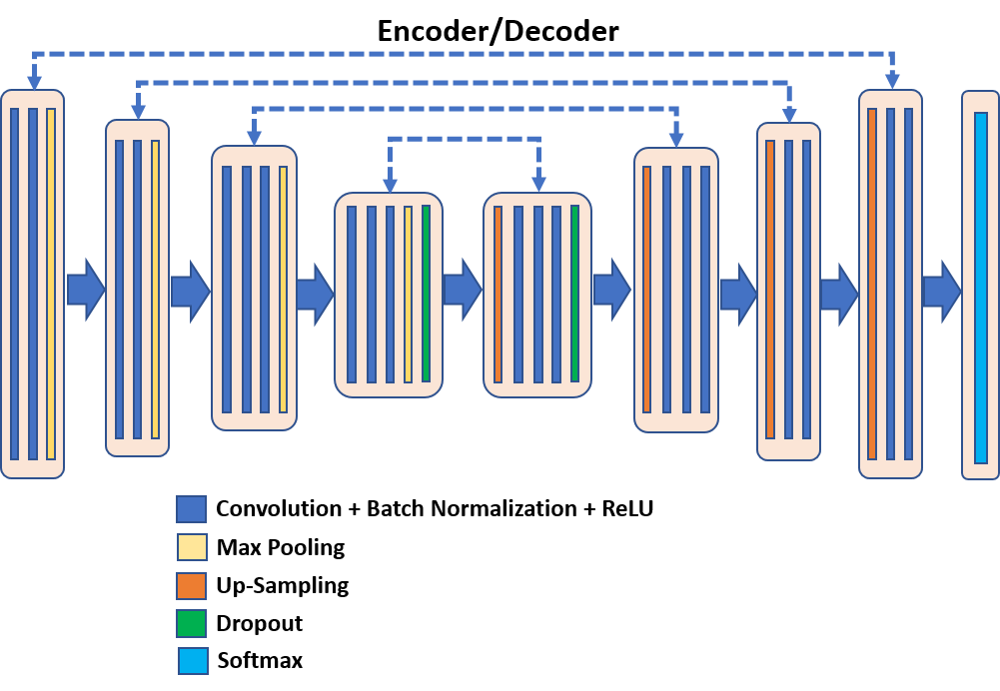

# SSNet for Semantic Segmentation

Semantic Segmentation is a fascinating application of deep learning and has become very popular among machine learning researchers. Semantic Segmentation or more commonly known as SemSeg is understanding an image at pixel level. Technically speaking, it is a CNN (Convolution Neural Network) which can classify every single pixel in an image as an object class. This also paves the way towards complete scene understanding. So much research have been done in this area since 2014 (Benchmarking Data: [https://www.cityscapes-dataset.com/benchmarks/](https://www.cityscapes-dataset.com/benchmarks/)) and now we are at a point where we have enough data and computational power to actually start seeing SemSeg in our life. SemSeg can also be applied to videos and 3D point-cloud data to obtain fine-grained semantics. Some of the commonly known CNN architectures for SemSeg are: FCN, VGG-16, SegNet, DeepLap, Dilated Convolutions

Inferring the knowledge about an image has a number of applications including in autonomous driving. SemSeg can help autonomous vehicles learn about its surroundings, specifically inferring the information about free road space and objects around it. Successful and accurate pixel-level prediction however depends on how well the network has been trained. Thanks to organizations like Cityscapes and KITTI, today we have large fine-annotated pixel-level datasets available to work with.

Here I have implemented SSNet. This architecture is a combination of VGG-16 and SegNet and is shown below. This is an encoder-decoder architecture in which we have 10 encoder layers followed by 10 corresponding decoder layers. Number of filters for each encoder layer are: first 2 layers - 64 filters, next 2 layers - 128 filters, next 3 layers - 256 filters, next 3 layers - 512 filters. The corresponding decoder have same number of filters. The decoder layers are followed by a softmax prediction layer with number of filters equal to the number of prediction classes.

This network was trained on just 200 labelled training images obtained from [KITTI pixel-level semantic dataset](http://www.cvlibs.net/datasets/kitti/eval_semseg.php?benchmark=semantics2015). The results shown in this post were generated by running this network on KITTI testing datasets. The video shown at the top only displays road and vehicle classes. Few semantic results generated for all the classes are shown below.  

| Test Image                        |  SSNet Prediction                 |
|:---------------------------------:|:---------------------------------:|
| | |
| | |
| | |

Pretrained weights can be downloaded [here](https://drive.google.com/open?id=1KG_-paGZmyxnSfPZGEv7uq_vTduXrLr3).
